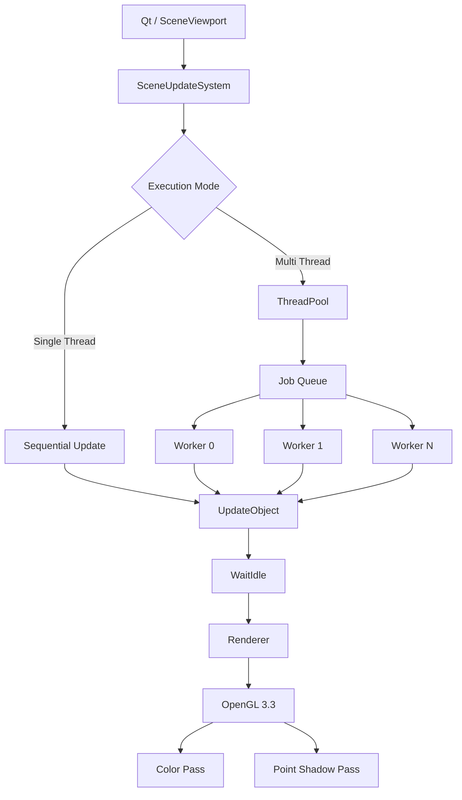
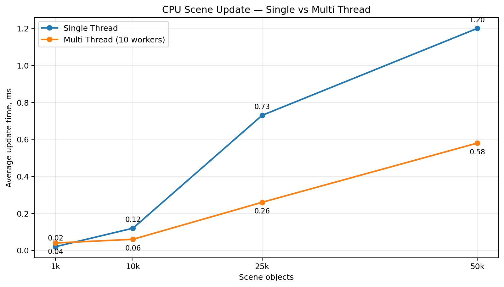

<div align="center">

# Mini Engine

### Интерактивный 3D-движок и редактор на C++ / Qt / OpenGL

**Mini Engine** — учебный графический движок с собственным редактором сцены, системой материалов и освещения, импортом 3D-моделей, Point Shadow Mapping и экспериментальной многопоточной системой обновления объектов.

Проект разрабатывается как выпускная квалификационная работа с фокусом на **многопоточную обработку интерактивной 3D-сцены** и измеримое сравнение Single Thread / Multi Thread режимов.


</div>

---

## О проекте 

Mini Engine сочетает две части:

- **Engine Core** — сцена, трансформации, камера, renderer, материалы, меши, освещение, тени, загрузка ресурсов и многопоточное обновление объектов.
- **Editor** — Qt-интерфейс в стиле игровых редакторов: `Hierarchy`, `Inspector`, `Project`, 3D viewport, gizmo-инструменты и окно нагрузочного тестирования.

Основная исследовательская часть проекта — сравнение двух стратегий CPU-обновления сцены — Однопоточная версия и многопоточная 

При этом логика обновления одного объекта остаётся одинаковой, а меняется только способ выполнения — последовательно или через собственный `ThreadPool`.

---

## Основные возможности

### 3D-сцена и редактор

- создание `Cube`, `Plane`, `Sphere`;
- импорт моделей Wavefront OBJ;
- собственный OBJ parser;
- поддержка `v`, `v/vt`, `v//vn`, `v/vt/vn`;
- `Hierarchy` объектов сцены;
- `Inspector` для редактирования параметров;
- `Project` panel для ресурсов;
- Ray Picking объектов во viewport;
- Move / Rotate / Scale gizmo;
- Perspective и Orthographic projection;
- фокусировка камеры на выбранном объекте;
- сохранение и загрузка сцены в формате `.scene`.

### Материалы и рендеринг

- OpenGL 3.3 Core;
- VAO / VBO / EBO;
- GLSL shaders;
- базовые материалы;
- diffuse textures;
- ambient / diffuse / specular lighting;
- несколько Point Light;
- визуальный маркер источника света;
- Point Shadow Mapping через depth cubemap;
- HiDPI / Retina-aware OpenGL viewport;
- мировая grid и цветные координатные оси.

### Многопоточность

В движке реализован собственный постоянный пул worker-потоков:

- очередь задач;
- `std::mutex`;
- `std::condition_variable`;
- `notify_one / notify_all`;
- ожидание полного завершения работы через `WaitIdle()`;
- контроль количества активных workers;
- разбиение SceneObjects на крупные chunks.

OpenGL-вызовы **не выполняются из worker-потоков**. Потоки занимаются CPU-side обновлением состояния объектов, после чего основной Qt/OpenGL поток продолжает Render Pass.

---

## Архитектура кадра



Ключевой принцип: `SingleThreaded` и `MultiThreaded` используют одну и ту же `UpdateObject()`. Благодаря этому benchmark сравнивает именно **модель выполнения**, а не разные алгоритмы.

---

## Управление

| Действие | Управление |
|---|---|
| Движение вперёд / назад | `W` / `S` |
| Движение влево / вправо | `A` / `D` |
| Движение вверх / вниз | `E` / `Q` |
| Поворот камеры | `Alt + ЛКМ` + движение мыши |
| Выбор объекта | `ЛКМ` |
| Работа с gizmo | `ЛКМ` по оси gizmo + drag |
| Приближение / отдаление | колесо мыши / trackpad scroll |
| Фокус на выбранном объекте | `F` |
| Perspective | `1` или `P` |
| Orthographic | `2` или `O` |
| Открыть модель | стандартный `Open` shortcut (`Ctrl/Cmd + O`) |
| Сохранить сцену | стандартный `Save` shortcut (`Ctrl/Cmd + S`) |

В Perspective scroll физически двигает камеру вдоль направления Forward.  
В Orthographic режиме scroll изменяет размер ортографической области.

---

## Benchmark

В Editor есть отдельное окно `Tests`, позволяющее выбрать:

- размер тестовой сцены;
- `Single Thread` или `Multi Thread`;
- количество объектов: `1k`, `10k`, `25k`, `50k`.

Измеряются:

- **Update** — CPU-обновление Scene;
- **Render** — время Render Pass;
- **Frame** — полное время кадра;
- **FPS**;
- **Workers**.

Для стабильного результата benchmark использует warm-up и отдельное измерительное окно.

### Результаты

| Objects | Mode | Workers | Update | Render | Frame | FPS |
|---:|---|---:|---:|---:|---:|---:|
| 1 000 | Single | 1 | 0.02 ms | 4.88 ms | 4.90 ms | 203.09 |
| 1 000 | Multi | 10 | 0.04 ms | 5.08 ms | 5.11 ms | 195.6 |
| 10 000 | Single | 1 | 0.12 ms | 33.62 ms | 33.74 ms | 29.6 |
| 10 000 | Multi | 10 | 0.06 ms | 33.65 ms | 33.71 ms | 29.7 |
| 25 000 | Single | 1 | 0.73 ms | 84.57 ms | 85.30 ms | 11.7 |
| 25 000 | Multi | 10 | 0.26 ms | 85.00 ms | 85.27 ms | 11.7 |
| 50 000 | Single | 1 | 1.20 ms | 171.97 ms | 173.17 ms | 5.8 |
| 50 000 | Multi | 10 | 0.58 ms | 172.40 ms | 172.99 ms | 5.8 |

### CPU Update: Single vs Multi

### Что видно по результатам

- На **1 000 объектах** Multi Thread медленнее: накладные расходы ThreadPool выше стоимости самой работы.
- На **10 000 объектах** Multi Thread сокращает Update примерно в `2x`.
- На **25 000 объектах** Update ускоряется примерно в `2.8x`.
- На **50 000 объектах** Update ускоряется примерно в `2.1x`.
- При больших сценах итоговый FPS почти не меняется, потому что главным bottleneck становится **Render**, а не Scene Update.

Это важный результат: многопоточность действительно ускоряет CPU-часть движка, но общее время кадра определяется самым дорогим этапом pipeline.

---

## ThreadPool

Упрощённая схема:

```text
Main Thread
    |
    | Enqueue jobs
    v
+---------------------------+
|         Task Queue        |
+---------------------------+
     |     |     |     |
     v     v     v     v
 Worker Worker Worker Worker
     |     |     |     |
     +-----+-----+-----+
                 |
                 v
              WaitIdle
                 |
                 v
               Render
```

Сцена делится на крупные диапазоны. Создание одной задачи на объект намеренно не используется — это породило бы слишком большие расходы на очередь и синхронизацию.

---

## Point Shadow Mapping

Тени для Point Light строятся с помощью depth cubemap. Для shadow-casting Point Light сцена рендерится в depth texture по шести направлениям. После Shadow Pass обычный Color Pass использует cubemap для определения того, находится ли фрагмент за препятствием относительно источника света.

Текущая реализация поддерживает несколько Point Light в основном освещении и один shadow-casting Point Light в shadow pass за кадр.

---

## Структура проекта

```text
Mini_Engine/
├── src/
│   ├── Editor/
│   │   ├── EditorWindow.*
│   │   ├── Panels/
│   │   │   ├── HierarchyPanel.*
│   │   │   ├── InspectorPanel.*
│   │   │   ├── ProjectPanel.*
│   │   │   └── TestsDialog.*
│   │   └── Viewport/
│   │       └── SceneViewport.*
│   └── Engine/
│       ├── Assets/
│       ├── Core/
│       ├── Jobs/
│       │   └── ThreadPool.*
│       ├── Math/
│       ├── Renderer/
│       ├── Scene/
│       ├── Shaders/
│       └── Tests/
└── CMakeLists.txt
```

---

## Сборка

### Требования

- компилятор с поддержкой **C++20**;
- **CMake**;
- **Qt 6**;
- Qt Widgets;
- Qt OpenGL;
- Qt OpenGLWidgets;
- OpenGL 3.3 Core;
- Ninja — рекомендуется, но не является обязательным.

### macOS

```bash
brew install cmake ninja qt
```

Конфигурация:

```bash
cmake -S . -B cmake-build-debug -G Ninja
```

Сборка Editor:

```bash
cmake --build cmake-build-debug --target mini_engine_editor -j 8
```

Запуск:

```bash
./cmake-build-debug/src/Editor/MiniEngineEditor
```

Также проект удобно открывать и собирать непосредственно из **CLion**.

---

## Технологический стек

| Область | Технологии |
|---|---|
| Язык | C++20 |
| Editor UI | Qt 6 / Widgets / QOpenGLWidget |
| Graphics API | OpenGL 3.3 Core |
| Shaders | GLSL |
| OpenGL loader | GLAD |
| Build system | CMake / Ninja |
| Models | Wavefront OBJ |
| Multithreading | `std::thread`, mutex, condition_variable, custom ThreadPool |
| Scene storage | собственный `.scene` format |
| Benchmarking | `std::chrono::steady_clock` |

---

## Особенности реализации

### Один Mesh — много SceneObject

Stress-сцены не создают новый GPU Mesh для каждого куба. Все тестовые объекты разделяют один mesh через `shared_ptr`.

```text
SceneObject 0 ─┐
SceneObject 1 ─┤
SceneObject 2 ─┼──> Shared Cube Mesh
...           ─┤
SceneObject N ─┘
```

### CPU Update отделён от Render

```text
CPU Update
    |
    v
WaitIdle
    |
    v
Render
```

Renderer не читает Transform одновременно с записью worker-потоками. Это упрощает модель синхронизации и предотвращает очевидную гонку между Update и Render стадиями.

### HiDPI / Retina

Qt использует логические пиксели, а OpenGL viewport — физические размеры framebuffer. Mini Engine учитывает `devicePixelRatioF()` при восстановлении viewport после shadow pass, что важно для корректного отображения на Retina / HiDPI дисплеях.

---

## Ограничения текущей версии

Проект активно развивается. На текущем этапе:

- Renderer выполняет много отдельных draw calls;
- instancing / batching ещё не являются основной стратегией рендеринга;
- при 25k–50k объектах Render становится главным bottleneck;
- OpenGL остаётся на основном GUI/GL потоке;
- ThreadPool используется для CPU-side Scene Update;
- автоматический `ExecutionMode::Auto` ещё не является основной стратегией;
- shadow pass ориентирован на один shadow-casting Point Light за кадр.

---

## Направления развития

- `ExecutionMode::Auto` с выбором Single / Multi по нагрузке;
- поиск экспериментальной точки переключения режима;
- instanced rendering;
- batching draw calls;
- frustum culling;
- более сложная Job System;
- расширение material system;
- несколько shadow-casting lights;
- автоматический экспорт benchmark-результатов.

---

## Исследовательский вывод


Текущий эксперимент показывает, что многопоточность эффективна не сама по себе, а при достаточном объёме CPU-работы.

На малых сценах стоимость синхронизации может быть выше выигрыша от параллелизма. При росте количества объектов собственный ThreadPool сокращает время обновления сцены примерно в `2–2.8x`.

Одновременно benchmark показывает второй важный эффект: после ускорения CPU Update узким местом становится Renderer. Это позволяет рассматривать Mini Engine не только как демонстрацию многопоточности, но и как экспериментальную платформу для исследования всего frame pipeline.

---
   
<div align="center">

**Mini Engine — from a single-threaded viewport to a measurable multithreaded 3D engine.**

</div>
